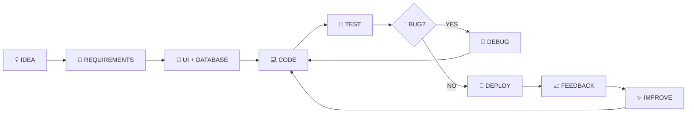
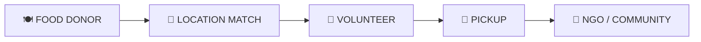
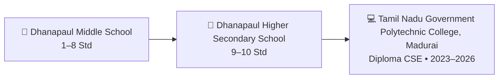

<div align="center">


<br/>

<a href="https://manikandan-portfolio-kdhi.vercel.app/"></a>
<a href="https://github.com/spiderboy-Manikandan"></a>
<a href="https://www.linkedin.com/in/manikandan-b-968bab348/"></a>

</div>

---

## 👋 About Me

I'm **Manikandan B** — a builder at heart, a **Diploma in Computer Science & Engineering graduate** at **Tamil Nadu Government Polytechnic College, Madurai**, with a **9.4 / 10 CGPA**.

What drives me is turning a rough idea into something people can actually click, use and break — then fixing it. Over the last few years that's meant shipping a full **PHP/MySQL e-commerce platform**, wiring up an **IoT attendance system** with an RC522 reader and a NodeMCU, and prototyping a **social-impact food redistribution concept**. I'm just as comfortable soldering a sensor as I am debugging a checkout flow at 1 a.m.

Right now I'm deepening my skills in **full-stack web development, databases, machine learning and data science**, while staying close to the hardware side through **IoT and networking**. I learn best by shipping — so most of what's below started as a "let's see if this works" idea.

<div align="center">

| 🎓 Education | 💻 Focus Areas | 📍 Based In |
|:---:|:---:|:---:|
| Diploma CSE • **9.4 / 10 CGPA** | Web • Software • IoT • AI | Madurai, Tamil Nadu |

</div>

---

## 🧑‍💻 Languages

<div align="center">


<br/>


<br/>


</div>

## 🧰 Developer Toolkits

<div align="center">


<br/><br/>

<br/><br/>


</div>

## 🤖 AI Tools

<div align="center">


</div>

---

## 🔄 How I Build Projects



<div align="center">

`IDEA` ➜ `DESIGN` ➜ `CODE` ➜ `TEST` ➜ `DEBUG` ➜ `DEPLOY` ➜ `IMPROVE`

</div>

---

# 🚀 Projects — From Systems to Applications

## 🚌 01 — Online Bus Ticket Booking System

A **PHP + MySQL full-stack booking application** for managing users, buses, routes, passengers, seats and bookings.

**Highlights**
- 👤 User registration, login and authentication
- 🚌 Bus, route and fare management
- 💺 Seat selection and seat availability
- 🎫 Ticket generation / printing
- 💳 Booking and payment workflow concept
- 🧑‍💼 Admin dashboard and management
- 🗄️ MySQL database integration

**Technology:** `HTML` `CSS` `Bootstrap` `JavaScript` `PHP` `MySQL`

<div align="center"></div>

---

## 📡 02 — RFID Lab Attendance System

An **IoT-based attendance system** connecting RFID hardware with software to record student attendance.

**Hardware**
- NodeMCU ESP8266
- RC522 RFID reader
- I2C LCD
- Buzzer

**Software / Integration**
- Arduino IDE
- Google Sheets / Sheets API
- Attendance dashboard concept
- Date, time, name and status tracking

**System Flow**

```text
RFID CARD
    ↓
RC522 READER
    ↓
NodeMCU ESP8266
    ↓
Attendance Logic
    ↓
Google Sheets
    ↓
Web Dashboard
```

**Technology:** `C/C++` `NodeMCU` `RFID` `Arduino IDE` `Google Sheets API`

<div align="center"></div>

---

## 🍱 03 — Food Redistribution System

A social-impact project concept connecting **restaurants, hotels and events** with **NGOs and volunteers** to help redistribute surplus food.



**Core Features**
- Food donor registration
- Location and availability matching
- Volunteer pickup coordination
- Notifications
- Donor / volunteer / NGO roles
- Food availability tracking
- Social-impact reporting

**Focus:** `Web Development` `MySQL` `Location Matching` `Notifications` `Social Impact`

<div align="center"></div>

---

## 💻 04 — Personal Portfolio Website

A responsive portfolio website built to present my **projects, education, certificates, skills and contact information**.

**Highlights from the portfolio**
- 🖥️ 3D animated desktop environment
- 🌗 Dark / light mode
- 🎮 Interactive games (Memory Match, Guess the Number, Tic-Tac-Toe AI, Rock-Paper-Scissors, Typing Speed Test)
- ✨ Scroll and page animations
- 📩 Contact form integration
- 📜 Resume and certificate section
- 🤖 AI assistant interface that answers questions about my skills, projects and education

**Technology:** `HTML` `CSS` `JavaScript`

🌐 **Live Portfolio:**
<a href="https://manikandan-portfolio-kdhi.vercel.app/"></a>

---

## 🛒 05 — Great Shopping — E-Commerce Website

> ⭐ **Latest / Featured Application**

A database-driven e-commerce project built with **PHP, MySQL, Bootstrap, JavaScript, HTML and CSS**, focusing on real-world CRUD, authentication, products, cart and order workflows.

### 🛍️ Customer Side

```text
LOGIN / REGISTER
       ↓
PRODUCTS → CATEGORY → PRODUCT DETAILS
       ↓
   CART / WISHLIST
       ↓
    CHECKOUT
       ↓
     ORDER
       ↓
   MY ORDERS
```

### 🧑‍💼 Admin Side

- ➕ Add / manage categories
- ➕ Add / manage products
- 📦 Manage orders
- 👥 Manage users
- 📊 Admin dashboard

**Technology:** `PHP` `MySQL` `Bootstrap 5.3.3` `JavaScript` `HTML` `CSS`

<div align="center"></div>

<a href="https://manikandan-portfolio-kdhi.vercel.app/"></a>

---

# 🎓 Education & Study Journey



| Period | Qualification | Institution | Result |
|---|---|---|---|
| **2023–2026** | Diploma in Computer Science & Engineering | Tamil Nadu Government Polytechnic College, Madurai | **9.4 / 10 CGPA** |
| **2022–2023** | SSLC / 10th | Dhanapaul Higher Secondary School, Madurai | **77%** |

---

# 📜 Certificates — What They Represent

| Certificate / Achievement | Provider | Result / Recognition | What It Demonstrates |
|---|---|---:|---|
| 🐍 **Python Training** | Spoken Tutorial, IIT Bombay | **95%** | Python fundamentals, scripting and programming practice |
| 🌐 **HTML Training** | Spoken Tutorial, IIT Bombay | **95%** | HTML structure and web-page development fundamentals |
| 🎨 **CSS Training** | Spoken Tutorial, IIT Bombay | — | Responsive styling, animation techniques and UI design |
| 🎓 **EduPyramids Training** | SINE, IIT Bombay | **85%** | Technical training and practical learning |
| 🔐 **Cybersecurity Seminar** | IUNOWARE | **Outstanding Performance** | Participation and performance in cybersecurity learning |
| 🌐 **Computer Networking** | NM Program | — | LAN/WAN concepts, connectivity and structured communication |
| 🗣️ **English Essentials** | NM Program | — | Communication skills and professional expression |

> 📌 Full certificate gallery — including college and school mark sheets — is on the [portfolio](https://manikandan-portfolio-kdhi.vercel.app/#certificates).

---

# 📊 GitHub Activity

<div align="center">


<br/><br/>


<br/><br/>


</div>

---

<!-- 🐍 Contribution Snake -->

<h2 align="center">🐍 Contribution Activity</h2>

<p align="center">
  
</p>

<hr>

## ⭐ Thanks for visiting my profile!

**Let's connect, learn and build something useful together. 🚀**

</div>
