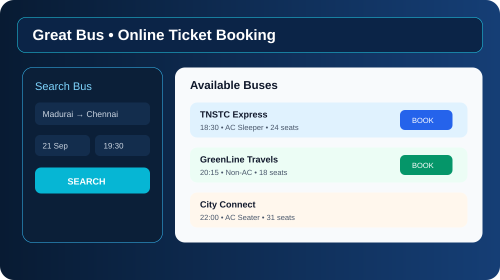
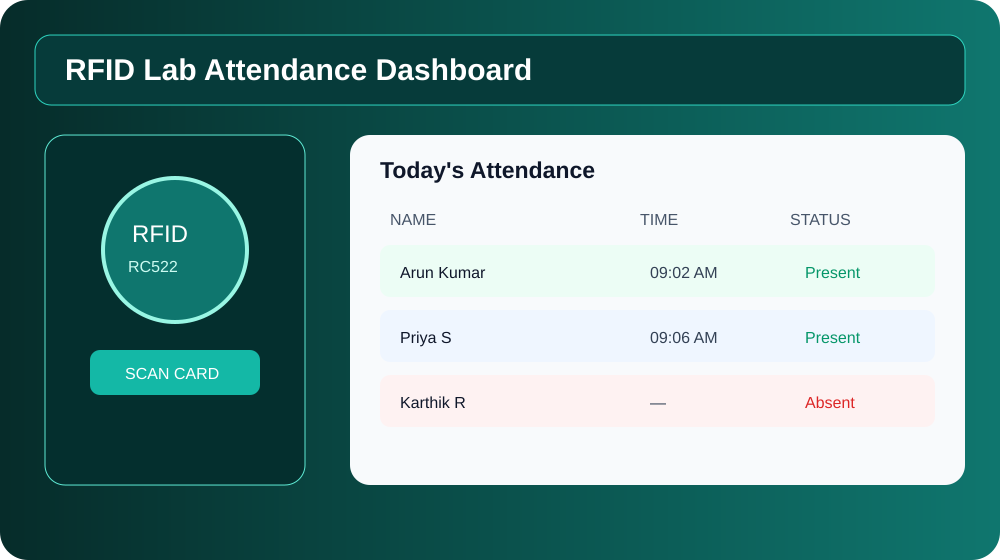
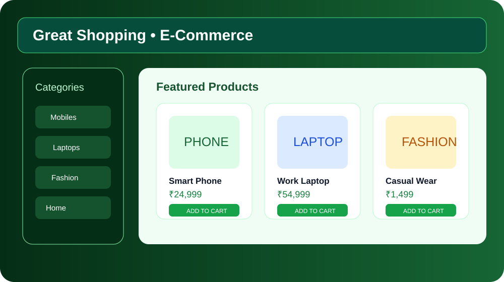
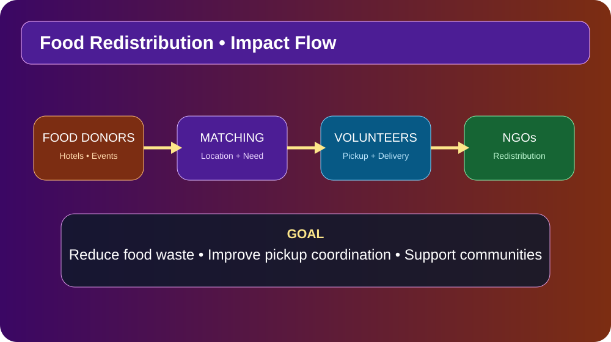
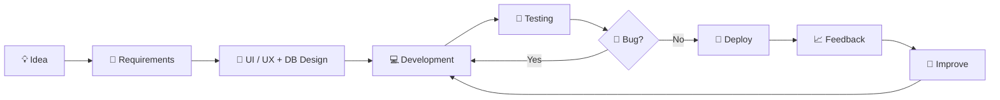
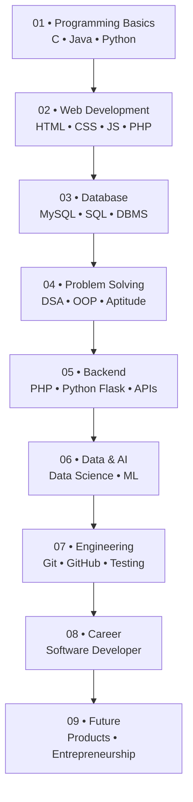

<div align="center">

# 👨‍💻 MANIKANDAN B

### `Diploma CSE` • `Software Developer` • `Full-Stack Web Developer`

<a href="https://github.com/spiderboy-Manikandan">

</a>

<br/>

<a href="https://manikandan-portfolio-kdhi.vercel.app/">🌐 <b>PORTFOLIO</b></a> &nbsp;•&nbsp;
<a href="https://www.linkedin.com/in/manikandan-b-968bab348/">💼 <b>LINKEDIN</b></a> &nbsp;•&nbsp;
<a href="https://manikandan-portfolio-kdhi.vercel.app/">📧 <b>CONTACT</b></a>

<br/><br/>


</div>

---

## 👋 About Me

Hi! I'm **Manikandan B**, a **Diploma in Computer Science & Engineering** graduate from **Tamil Nadu Government Polytechnic College, Madurai**, with a **9.4 / 10 CGPA**.

I learn by building practical projects and improving my programming fundamentals. My interests include software development, full-stack web applications, databases, IoT, machine learning, data science and problem solving.

| 🎓 Education | 💻 Focus | 📍 Location |
|---|---|---|
| Diploma CSE • **9.4 / 10** | Software & Full-Stack Development | Madurai, Tamil Nadu, India |

---

# 🧩 Technical Skills — Colorful Categories

<div align="center">

### 🟧 Web Development

`HTML` `CSS` `JavaScript` `PHP`


### 🟦 Programming

`C` `Python` `Java`


### 🟪 Data, AI & Computer Science

`Machine Learning` `Data Science` `Digital Logic Design`


### 🟩 Database, Network & Hardware

`MySQL` `Computer Network` `Computer Hardware`


### 🟦 Development & Professional Tools

`VS Code` `Antigravity` `GitHub` `LinkedIn` `MS Office` `Word` `Excel` `PowerPoint` `Arduino IDE` `Cisco`


### 🤖 AI Tools

`ChatGPT` `Gemini` `DeepSeek` `GitHub Copilot` `Claude` `Gamma`


</div>

---

# 🚀 Projects — Detailed Showcase

## 🚌 01. Online Bus Ticket Booking System

A **PHP + MySQL full-stack booking application** designed to manage users, buses, routes, passengers, seats and bookings.

**Main modules**
- 👤 Registration, login and user authentication
- 🚌 Bus, route and fare management
- 💺 Seat selection and automatic seat availability
- 🎫 Ticket generation / printing
- 💳 Booking and payment workflow concept
- 🧑‍💼 Admin dashboard and management
- 🗄️ MySQL database integration

**Stack:** `HTML` `CSS` `Bootstrap` `JavaScript` `PHP` `MySQL`

<div align="center"></div>

---

## 📡 02. RFID Lab Attendance System

An **IoT-based attendance system** connecting RFID hardware with software to record student attendance automatically.

**Hardware**
- NodeMCU ESP8266
- RC522 RFID reader
- I2C LCD
- Buzzer

**Software / Integration**
- Arduino IDE
- Google Sheets API / Sheets storage
- Attendance website concept
- Date, time, name and status tracking

**Flow:** `RFID Card → NodeMCU → Attendance Logic → Google Sheets → Web Dashboard`

**Stack:** `C/C++` `NodeMCU` `RFID` `Arduino IDE` `Google Sheets API`

<div align="center"></div>

---

## 🛒 03. Great Shopping — E-Commerce Website

A database-driven e-commerce application built to practice **real-world CRUD, authentication, product management, cart and order workflows**.

**Customer side**
- 👤 Registration / login
- 🛍️ Product browsing and categories
- 🛒 Cart and wishlist
- 📦 Checkout and orders
- 🧾 Order history

**Admin side**
- ➕ Add / manage categories
- ➕ Add / manage products
- 📦 Manage orders
- 👥 Manage users
- 📊 Dashboard

**Stack:** `PHP` `MySQL` `Bootstrap` `JavaScript` `HTML` `CSS`

<div align="center"></div>

---

## 🍱 04. Food Redistribution System

A social-impact project concept designed to connect **restaurants, hotels and events** with **NGOs and volunteers** to help redistribute surplus food.

**Core workflow**
- 🍽️ Donor registers surplus food
- 📍 System matches location and availability
- 🔔 Volunteer receives pickup information
- 🚚 Food is collected and delivered
- 🤝 NGO/community receives the food

**Potential features**
- Location matching
- Pickup scheduling
- Notifications
- Donor / volunteer / NGO roles
- Food availability tracking
- Social-impact reporting

**Focus:** `Web Development` `MySQL` `Location Matching` `Notifications` `Social Impact`

<div align="center"></div>

---

# 🔄 Development Flow — New Design



---

# 🗺️ Learning Roadmap



---

# 🎓 Education

| Period | Qualification | Institution | Result |
|---|---|---|---|
| **2023–2026** | Diploma in Computer Science & Engineering | Tamil Nadu Government Polytechnic College, Madurai | **9.4 / 10 CGPA** |
| **2022–2023** | SSLC / 10th | Dhanapaul Higher Secondary School, Madurai | **77%** |

---

# 📜 Certificates

- 🐍 **Python Training** — Spoken Tutorial, IIT Bombay
- 🌐 **HTML Training** — Spoken Tutorial, IIT Bombay
- 🎨 **CSS Training** — Spoken Tutorial
- 💻 **EduPyramids Training** — SINE, IIT Bombay
- 🔐 **Cybersecurity Seminar** — IUNOWARE

---

# 📊 GitHub Stats

<div align="center">


<br/><br/>


</div>

---

# 🐍 Contribution Snake — Stable Version

<div align="center">

<picture>
  <source media="(prefers-color-scheme: dark)" srcset="https://raw.githubusercontent.com/spiderboy-Manikandan/spiderboy-Manikandan/output/github-contribution-grid-snake-dark.svg">
  <source media="(prefers-color-scheme: light)" srcset="https://raw.githubusercontent.com/spiderboy-Manikandan/spiderboy-Manikandan/output/github-contribution-grid-snake.svg">
  
</picture>

<br/>

<sub>🐍 Updated automatically by GitHub Actions • Dark/light SVG fallback included</sub>

</div>

---

# 🎯 Career Focus

```text
Learn Fundamentals
        ↓
Build Strong Coding Skills
        ↓
Practice DSA + Aptitude
        ↓
Build Real Projects
        ↓
Improve Communication
        ↓
Join a Software Development Team
        ↓
Grow into a Strong Software Developer
        ↓
Future: Build Products / Startup
```

---

# 🔘 Different Button Styles

<div align="center">

<a href="https://manikandan-portfolio-kdhi.vercel.app/"></a>
<a href="https://www.linkedin.com/in/manikandan-b-968bab348/"></a>

<br/>

<a href="https://github.com/spiderboy-Manikandan"></a>
<a href="https://manikandan-portfolio-kdhi.vercel.app/"></a>

</div>

---

# 💡 Developer Mindset

<div align="center">

### `LEARN` → `BUILD` → `TEST` → `DEBUG` → `IMPROVE` → `REPEAT`

**“Small steps every day lead to big results.”** 🚀

</div>

---

<div align="center">

### ⭐ Thanks for visiting my profile!

**Let's connect, learn and build something useful together.**

</div>
