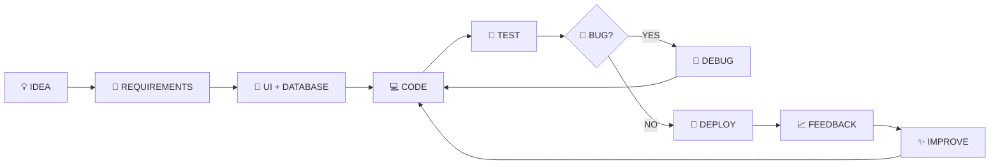
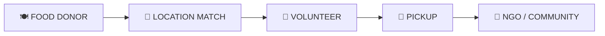
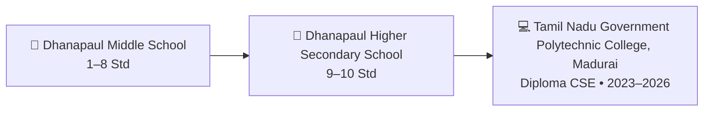
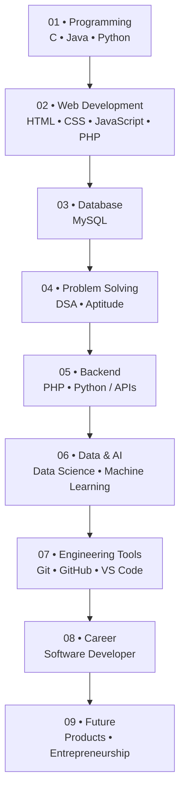

<div align="center">

# 👨‍💻 MANIKANDAN B

### `Diploma CSE` • `Software Developer` • `Full-Stack Web Developer`


<br/>

<a href="https://manikandan-portfolio-kdhi.vercel.app/"></a>
<a href="https://github.com/spiderboy-Manikandan"></a>
<a href="https://www.linkedin.com/in/manikandan-b-968bab348/"></a>

<br/><br/>


</div>

---

# 🧭 Profile Map

```text
┌─────────────────────────────────────────────────────────────┐
│  👋 ABOUT  →  🛠️ SKILLS  →  🚀 PROJECTS  →  🎓 EDUCATION │
│       ↓                                                   │
│  📜 CERTIFICATES  →  📊 GITHUB  →  🐍 SNAKE  →  🤝 CONNECT │
└─────────────────────────────────────────────────────────────┘
```

## 👋 About Me

Hi! I'm **Manikandan B**, a **Diploma in Computer Science & Engineering** graduate from **Tamil Nadu Government Polytechnic College, Madurai**, with a **9.4 / 10 CGPA**.

I enjoy learning by building practical software. My interests include **full-stack web development, databases, IoT, machine learning, data science, networking and problem solving**.

<div align="center">

| 🎓 Education | 💻 Development Focus | 📍 Based In |
|:---:|:---:|:---:|
| Diploma CSE • **9.4 / 10** | Web • Software • IoT | Madurai, Tamil Nadu |

</div>

---

# ⚡ Technical Skills — Interactive-Style Sections

> A colorful skill map instead of a traditional percentage/skill-bar layout.

### 🌐 Web Development

<div align="center">


</div>

### 💻 Programming

<div align="center">


</div>

### 🤖 AI, Data & Computer Science

<div align="center">


</div>

### 🗄️ Database, Network & Hardware

<div align="center">


</div>

### 🧰 Development & Professional Tools

<div align="center">


<br/>


</div>

### 🧠 AI Tools

<div align="center">


</div>

---

# 🔄 How I Build Projects



<div align="center">

`IDEA` ➜ `DESIGN` ➜ `CODE` ➜ `TEST` ➜ `DEBUG` ➜ `DEPLOY` ➜ `IMPROVE`

</div>

---

# 🚀 Projects — From Systems to Applications

## 🚌 01 — Online Bus Ticket Booking System

A **PHP + MySQL full-stack booking application** for managing users, buses, routes, passengers, seats and bookings.

**Highlights**
- 👤 User registration, login and authentication
- 🚌 Bus, route and fare management
- 💺 Seat selection and seat availability
- 🎫 Ticket generation / printing
- 💳 Booking and payment workflow concept
- 🧑‍💼 Admin dashboard and management
- 🗄️ MySQL database integration

**Technology:** `HTML` `CSS` `Bootstrap` `JavaScript` `PHP` `MySQL`

<div align="center"></div>

---

## 📡 02 — RFID Lab Attendance System

An **IoT-based attendance system** connecting RFID hardware with software to record student attendance.

**Hardware**
- NodeMCU ESP8266
- RC522 RFID reader
- I2C LCD
- Buzzer

**Software / Integration**
- Arduino IDE
- Google Sheets / Sheets API
- Attendance dashboard concept
- Date, time, name and status tracking

**System Flow**

```text
RFID CARD
    ↓
RC522 READER
    ↓
NodeMCU ESP8266
    ↓
Attendance Logic
    ↓
Google Sheets
    ↓
Web Dashboard
```

**Technology:** `C/C++` `NodeMCU` `RFID` `Arduino IDE` `Google Sheets API`

<div align="center"></div>

---

## 🍱 03 — Food Redistribution System

A social-impact project concept connecting **restaurants, hotels and events** with **NGOs and volunteers** to help redistribute surplus food.



**Core Features**
- Food donor registration
- Location and availability matching
- Volunteer pickup coordination
- Notifications
- Donor / volunteer / NGO roles
- Food availability tracking
- Social-impact reporting

**Focus:** `Web Development` `MySQL` `Location Matching` `Notifications` `Social Impact`

<div align="center"></div>

---

## 💻 04 — Personal Portfolio Website

A responsive portfolio website built to present my **projects, education, certificates, skills and contact information**.

**Highlights from the portfolio**
- 🖥️ 3D animated desktop environment
- 🌗 Dark / light mode
- 🎮 Interactive games
- ✨ Scroll and page animations
- 📩 Contact form integration
- 📜 Resume and certificate section
- 🤖 AI assistant interface

**Technology:** `HTML` `CSS` `JavaScript`

🌐 **Live Portfolio:**  
<a href="https://manikandan-portfolio-kdhi.vercel.app/"></a>

---

## 🛒 05 — Great Shopping — E-Commerce Website

> ⭐ **Latest / Featured Application**

A database-driven e-commerce project built with **PHP, MySQL, Bootstrap, JavaScript, HTML and CSS**, focusing on real-world CRUD, authentication, products, cart and order workflows.

### 🛍️ Customer Side

```text
LOGIN / REGISTER
       ↓
PRODUCTS → CATEGORY → PRODUCT DETAILS
       ↓
   CART / WISHLIST
       ↓
    CHECKOUT
       ↓
     ORDER
       ↓
   MY ORDERS
```

### 🧑‍💼 Admin Side

- ➕ Add / manage categories
- ➕ Add / manage products
- 📦 Manage orders
- 👥 Manage users
- 📊 Admin dashboard

**Technology:** `PHP` `MySQL` `Bootstrap 5.3.3` `JavaScript` `HTML` `CSS`

<div align="center"></div>

<a href="https://manikandan-portfolio-kdhi.vercel.app/"></a>

---

# 🎓 Education & Study Journey



| Period | Qualification | Institution | Result |
|---|---|---|---|
| **2023–2026** | Diploma in Computer Science & Engineering | Tamil Nadu Government Polytechnic College, Madurai | **9.4 / 10 CGPA** |
| **2022–2023** | SSLC / 10th | Dhanapaul Higher Secondary School, Madurai | **77%** |

---

# 📜 Certificates — What They Represent

| Certificate / Achievement | Provider | Result / Recognition | What It Demonstrates |
|---|---|---:|---|
| 🐍 **Python Training** | Spoken Tutorial, IIT Bombay | **95%** | Python fundamentals, scripting and programming practice |
| 🌐 **HTML Training** | Spoken Tutorial, IIT Bombay | **95%** | HTML structure and web-page development fundamentals |
| 🎓 **EduPyramids Training** | SINE, IIT Bombay | **85%** | Technical training and practical learning |
| 🔐 **Cybersecurity Seminar** | IUNOWARE | **Outstanding Performance** | Participation and performance in cybersecurity learning |

> 📌 My portfolio also contains academic records and additional certificate/achievement sections. Certificate files can be linked directly when their final URLs are available.

---

# 📊 GitHub Activity

<div align="center">


<br/><br/>


</div>

---

# 🐍 Contribution Snake

<div align="center">


<br/>

<sub>Automatically generated by GitHub Actions. If it is not visible immediately, run the workflow once manually and refresh after the output branch is created.</sub>

</div>

---

# 🧩 Snake Setup

The workflow is included at:

```text
.github/workflows/snake.yml
```

### Required setup

1. Put this README and `.github/workflows/snake.yml` in the **`spiderboy-Manikandan` profile repository**.
2. In **Settings → Actions → General**, allow GitHub Actions to run.
3. In **Settings → Actions → General → Workflow permissions**, select **Read and write permissions**.
4. Open **Actions → 🐍 Contribution Snake → Run workflow** once.
5. The workflow creates/updates the **`output` branch**.
6. The README image then loads from that branch.

---

# 🎯 Current Learning Path



---

# 🔘 Connect With Me

<div align="center">

<a href="https://manikandan-portfolio-kdhi.vercel.app/"></a>
<a href="https://github.com/spiderboy-Manikandan"></a>
<a href="https://www.linkedin.com/in/manikandan-b-968bab348/"></a>

<br/><br/>

`LEARN` → `BUILD` → `TEST` → `DEBUG` → `IMPROVE` → `REPEAT`

### ⭐ Thanks for visiting my profile!

**Let's connect, learn and build something useful together. 🚀**

</div>
