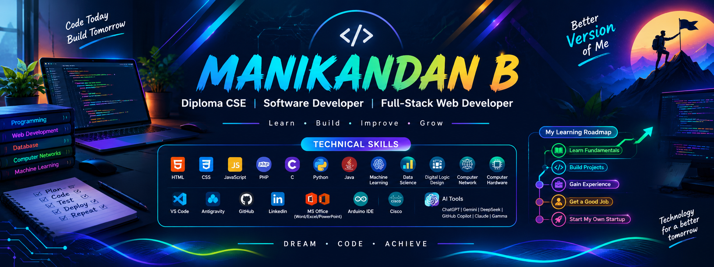

<div align="center">

# 👨‍💻 MANIKANDAN B

### `Diploma CSE` • `Software Developer` • `Full-Stack Web Developer`



<br/>

<a href="https://github.com/spiderboy-Manikandan">

</a>

<br/>

<a href="https://manikandan-portfolio-kdhi.vercel.app/">

</a>
<a href="https://www.linkedin.com/in/manikandan-b-968bab348/">

</a>
<a href="https://manikandan-portfolio-kdhi.vercel.app/">

</a>

<br/><br/>


</div>

---

## 👋 About Me

Hi! I'm **Manikandan B**, a **Diploma in Computer Science & Engineering** graduate from **Tamil Nadu Government Polytechnic College, Madurai**, with a **9.4 / 10 CGPA**.

I learn mainly by **building projects, solving programming problems, and experimenting with technology**. My interests include software development, full-stack web applications, databases, IoT, machine learning and practical problem solving.

<div align="center">

| 🎓 Education | 💻 Focus | 📍 Location |
|---|---|---|
| Diploma CSE • **9.4 / 10** | Software & Full-Stack Development | Madurai, Tamil Nadu, India |

</div>

---

# 💻 Technical Skills

<div align="center">

## 🌐 Web & Programming


`HTML` `CSS` `JavaScript` `PHP` `C` `Python` `Java`

## 🤖 Data, AI & Computer Science


`Machine Learning` `Data Science` `Digital Logic Design` `MySQL` `Computer Networks` `Computer Hardware`

## 🧰 Development & Professional Tools


`VS Code` `Antigravity` `GitHub` `LinkedIn` `MS Office` `Word` `Excel` `PowerPoint` `Arduino IDE` `Cisco`

## 🧠 AI Tools

`ChatGPT` `Gemini` `DeepSeek` `GitHub Copilot` `Claude` `Gamma`

</div>

> **Note:** I describe these as skills/tools I use or learn with; I continue improving depth through projects and practice.

---

# 🚀 Featured Projects

<div align="center">

<table>
<tr>
<td width="50%">

### 🚌 Online Bus Ticket Booking

A full-stack booking application using **PHP + MySQL + JavaScript + HTML + CSS**.

**Includes**
- 👤 User authentication
- 🚌 Bus & route management
- 💺 Seat selection
- 🎫 Ticket generation
- 💳 Payment/booking workflow
- 🛠️ Admin management

</td>
<td width="50%">

### 📡 RFID Lab Attendance

An IoT attendance system using **NodeMCU ESP8266 + RC522 + LCD + Google Sheets**.

**Includes**
- 🪪 RFID student identification
- ⏱️ Date & time recording
- 📊 Attendance data
- 🔔 Buzzer feedback
- 🌐 Hardware/software integration

</td>
</tr>

<tr>
<td width="50%">

### 🛒 Great Shopping

A database-driven e-commerce project built with **PHP + MySQL + Bootstrap + JavaScript**.

**Includes**
- 🛍️ Products & categories
- 🛒 Cart & wishlist
- 👤 User accounts
- 📦 Orders
- 🧑‍💼 Admin dashboard
- 🗄️ MySQL database

</td>
<td width="50%">

### 🍱 Food Redistribution System

A social-impact project concept connecting food donors, NGOs and volunteers.

**Flow**
- 🍽️ Restaurants / Hotels / Events
- 📦 Surplus food
- 📍 Location matching
- 🚚 Pickup by volunteers
- 🤝 NGO redistribution

</td>
</tr>
</table>

</div>

---

# 🔄 Development Flow

```text
┌─────────────┐
│ 💡 IDEA     │
└──────┬──────┘
       ↓
┌─────────────┐
│ 🔎 ANALYZE  │
│ Requirements│
└──────┬──────┘
       ↓
┌─────────────┐
│ 🎨 DESIGN   │
│ UI + DB     │
└──────┬──────┘
       ↓
┌─────────────┐
│ 💻 CODE     │
│ Development │
└──────┬──────┘
       ↓
┌─────────────┐
│ 🧪 TEST     │
│ Debug + QA  │
└──────┬──────┘
       ↓
┌─────────────┐
│ 🚀 DEPLOY   │
│ Release     │
└──────┬──────┘
       ↓
┌─────────────┐
│ 🔧 IMPROVE  │
│ Feedback    │
└──────┬──────┘
       ↺
```

---

# 🗺️ My Developer Roadmap

<div align="center">

```text
01
FOUNDATION
C • Java • Python
        ↓
02
WEB DEVELOPMENT
HTML • CSS • JavaScript • PHP
        ↓
03
DATABASE
MySQL • SQL • DBMS
        ↓
04
PROBLEM SOLVING
DSA • OOP • Aptitude
        ↓
05
BACKEND
PHP • Python Flask • APIs
        ↓
06
DATA & AI
Data Science • ML • AI Tools
        ↓
07
ENGINEERING
Git • GitHub • Testing • Deployment
        ↓
08
CAREER
Software Developer → Full-Stack Developer
        ↓
09
FUTURE
Products • Entrepreneurship • Startup
```

</div>

---

# 🎯 Career Focus

### Current Goals

- 🧩 Strengthen **C, Java and Python fundamentals**
- 🧠 Practice **Data Structures & Algorithms**
- 🌐 Improve **Full-Stack Web Development**
- 🗄️ Build stronger **MySQL / DBMS** knowledge
- 🤖 Learn practical **Machine Learning & Data Science**
- 🔧 Build and document real projects
- 💬 Improve communication and technical interview skills
- 💼 Prepare for entry-level software development opportunities
- 🚀 Long-term: build useful products and explore entrepreneurship

### My Learning Cycle

```text
        📚 LEARN
           ↓
        💻 BUILD
           ↓
       🧪 TEST
           ↓
      🐛 DEBUG
           ↓
       📈 IMPROVE
           ↓
        🔁 REPEAT
```

---

# 🎓 Education

| Period | Qualification | Institution | Result |
|---|---|---|---|
| **2023 – 2026** | Diploma in Computer Science & Engineering | Tamil Nadu Government Polytechnic College, Madurai | **9.4 / 10 CGPA** |
| **2022 – 2023** | SSLC / 10th | Dhanapaul Higher Secondary School, Madurai | **77%** |

---

# 📜 Certificates

<div align="center">

| 📜 Certificate | 🏫 Provider |
|---|---|
| 🐍 Python Training | Spoken Tutorial — IIT Bombay |
| 🌐 HTML Training | Spoken Tutorial — IIT Bombay |
| 🎨 CSS Training | Spoken Tutorial |
| 💻 EduPyramids Training | SINE — IIT Bombay |
| 🔐 Cybersecurity Seminar | IUNOWARE |

</div>

> Certificate proofs can be linked to the corresponding files/pages from my portfolio.

---

# 📊 GitHub Analytics

<div align="center">

<a href="https://github.com/spiderboy-Manikandan">

</a>

<a href="https://github.com/spiderboy-Manikandan">

</a>

<br/><br/>


</div>

---

# 🐍 Contribution Snake

<div align="center">

<picture>
  <source media="(prefers-color-scheme: dark)" srcset="https://raw.githubusercontent.com/spiderboy-Manikandan/spiderboy-Manikandan/output/github-contribution-grid-snake-dark.svg">
  <source media="(prefers-color-scheme: light)" srcset="https://raw.githubusercontent.com/spiderboy-Manikandan/spiderboy-Manikandan/output/github-contribution-grid-snake.svg">
  
</picture>

</div>

---

# ✨ Professional Badges

<div align="center">


<br/><br/>


</div>

---

# 📫 Connect With Me

<div align="center">

<a href="https://manikandan-portfolio-kdhi.vercel.app/">

</a>

<a href="https://www.linkedin.com/in/manikandan-b-968bab348/">

</a>

<a href="https://manikandan-portfolio-kdhi.vercel.app/">

</a>

</div>

> **Email button:** currently points to your portfolio/contact page because I don't have a verified email address from your current GitHub/portfolio links. If you give me your preferred email, I can replace it with a direct `mailto:` button.

---

<div align="center">

### 💡 “Small steps every day lead to big dreams.”

**Learn • Build • Improve • Grow**


</div>
