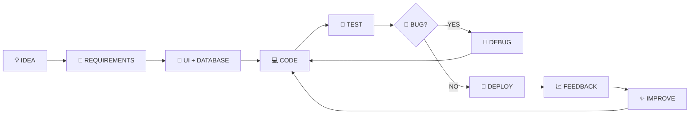
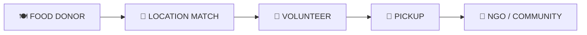
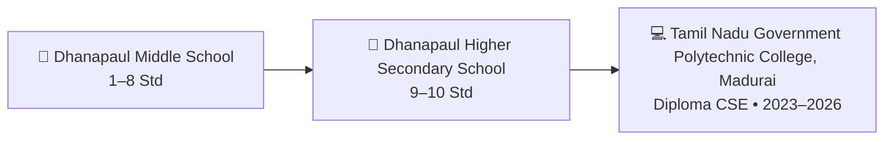

<div align="center">


<br/>

<a href="https://manikandan-portfolio-kdhi.vercel.app/"></a>
<a href="https://github.com/spiderboy-Manikandan"></a>
<a href="https://www.linkedin.com/in/manikandan-b-968bab348/"></a>
<a href="mailto:compmanikandanb23@gmail.com"></a>
<a href="https://wa.me/917094964875"></a>

<br/><br/>


<br/><br/>

</div>

---

## 👋 About Me

<div align="center">

</div>

I'm **Manikandan B** — a builder at heart, currently finishing my **Diploma in Computer Science & Engineering** at **Tamil Nadu Government Polytechnic College, Madurai**, with a **9.4 / 10 CGPA**.

What drives me is turning a rough idea into something people can actually click, use and break — then fixing it. Over the last few years that's meant shipping a full **PHP/MySQL e-commerce platform**, wiring up an **IoT attendance system** with an RC522 reader and a NodeMCU, and prototyping a **social-impact food redistribution concept**. I'm just as comfortable soldering a sensor as I am debugging a checkout flow at 1 a.m.

Right now I'm deepening my skills in **full-stack web development, databases, machine learning and data science**, while staying close to the hardware side through **IoT and networking**. I learn best by shipping — so most of what's below started as a "let's see if this works" idea.

<div align="center">

| 🎓 Education                     | 💻 Focus Areas             | 📍 Based In          |
| ------------------------------- | ------------------------- | -------------------- |
| Diploma CSE • **9.4 / 10 CGPA** | Web • Software • IoT • AI | Madurai, Tamil Nadu  |

</div>

---

## 🧑‍💻 Languages

<div align="center">


<br/><br/>

<a href="https://skillicons.dev">
  
</a>

</div>

## 🧰 Developer Toolkits & Hardware

<div align="center">


<br/><br/>

<a href="https://skillicons.dev">
  
</a>

<br/><br/>

<p align="center">
  
  
  
  
  
  
</p>

</div>

## 🤖 AI Tools

<div align="center">


<br/><br/>

<p align="center">
  
  
  
  
  
  
  
</p>

</div>

---

## 🔄 How I Build Projects


```mermaid
flowchart LR
    A["💡 IDEA"] --> B["🔎 REQUIREMENTS"]
    B --> C["🎨 UI + DATABASE"]
    C --> D["💻 CODE"]
    D --> E["🧪 TEST"]
    E --> F{"🐛 BUG?"}
    F -->|YES| G["🔧 DEBUG"]
    G --> D
    F -->|NO| H["🚀 DEPLOY"]
    H --> I["📈 FEEDBACK"]
    I --> J["✨ IMPROVE"]
    J --> D
```

<div align="center">

`IDEA` ➜ `DESIGN` ➜ `CODE` ➜ `TEST` ➜ `DEBUG` ➜ `DEPLOY` ➜ `IMPROVE`

</div>

---

# 🚀 Projects — From Systems to Applications

<div align="center">

</div>

## 🚌 01 — Online Bus Ticket Booking System

A **PHP + MySQL full-stack booking application** for managing users, buses, routes, passengers, seats and bookings.

**Highlights**
- 👤 User registration, login and authentication
- 🚌 Bus, route and fare management
- 💺 Seat selection and seat availability
- 🎫 Ticket generation / printing
- 💳 Booking and payment workflow concept
- 🧑‍💼 Admin dashboard and management
- 🗄️ MySQL database integration

**Technology:** `HTML` `CSS` `Bootstrap` `JavaScript` `PHP` `MySQL`

<div align="center"></div>

<a href="https://github.com/spiderboy-Manikandan/online-Bus-Ticket-Booking"></a>

---

## 📡 02 — RFID Lab Attendance System

An **IoT-based attendance system** connecting RFID hardware with software to record student attendance.

**Hardware**
- NodeMCU ESP8266
- RC522 RFID reader
- I2C LCD
- Buzzer

**Software / Integration**
- Arduino IDE
- Google Sheets / Sheets API
- Attendance dashboard concept
- Date, time, name and status tracking

**System Flow**

```text
RFID CARD
    ↓
RC522 READER
    ↓
NodeMCU ESP8266
    ↓
Attendance Logic
    ↓
Google Sheets
    ↓
Web Dashboard
```

<div align="center"></div>

---

## 🍱 03 — Food Redistribution System (Concept)

A social-impact project concept connecting **restaurants, hotels and events** with **NGOs and volunteers** to help redistribute surplus food.


```mermaid
flowchart LR
    A["🍽️ FOOD DONOR"] --> B["📍 LOCATION MATCH"]
    B --> C["🔔 VOLUNTEER"]
    C --> D["🚚 PICKUP"]
    D --> E["🤝 NGO / COMMUNITY"]
```

**Core Features**
- Food donor registration
- Location and availability matching
- Volunteer pickup coordination
- Notifications
- Donor / volunteer / NGO roles
- Food availability tracking
- Social-impact reporting

**Focus:** `Web Development` `MySQL` `Location Matching` `Notifications` `Social Impact`

<div align="center"></div>

> ⚠️ **Concept stage** — even a basic working prototype pushed as a repo will outweigh a polished diagram.

---

## 💻 04 — Personal Portfolio Website

A responsive portfolio built to present my **projects, education, certificates, skills and contact information**, featuring a 3D animated desktop environment, dark/light mode, interactive mini-games, and an AI assistant that answers questions about my work.

**Technology:** `HTML` `CSS` `JavaScript`

<a href="https://manikandan-portfolio-kdhi.vercel.app/"></a>
<a href="https://github.com/spiderboy-Manikandan/Manikandan-Portfolio"></a>

---

## 🛒 05 — Great Shopping — E-Commerce Website ⭐ Featured

A database-driven e-commerce project built with **PHP, MySQL, Bootstrap, JavaScript, HTML and CSS**, focusing on real-world CRUD, authentication, products, cart and order workflows.

### 🛍️ Customer Side

```text
LOGIN / REGISTER
       ↓
PRODUCTS → CATEGORY → PRODUCT DETAILS
       ↓
   CART / WISHLIST
       ↓
    CHECKOUT
       ↓
     ORDER
       ↓
   MY ORDERS
```

### 🧑‍💼 Admin Side

- ➕ Add / manage categories
- ➕ Add / manage products
- 📦 Manage orders
- 👥 Manage users
- 📊 Admin dashboard

**Technology:** `PHP` `MySQL` `Bootstrap 5.3.3` `JavaScript` `HTML` `CSS`

<div align="center"></div>

> ⚠️ **Not yet a public repo.** This is your strongest, most recent project — push it to a repo named e.g. `great-shopping-ecommerce` so recruiters can actually open the code, not just read about it here.

---

# 🎓 Education & Study Journey

<div align="center">

</div>


```mermaid
flowchart LR
    A["🏫 Dhanapaul Middle School<br/>1–8 Std"] --> B["🏫 Dhanapaul Higher Secondary School<br/>9–10 Std"] --> C["💻 Tamil Nadu Government Polytechnic College, Madurai<br/>Diploma CSE • 2023–2026"]
```

| Period        | Qualification                             | Institution                                        | Result            |
| ------------- | ------------------------------------------ | --------------------------------------------------- | ------------------ |
| **2023–2026** | Diploma in Computer Science & Engineering | Tamil Nadu Government Polytechnic College, Madurai | **9.4 / 10 CGPA** |
| **2022–2023** | SSLC / 10th                               | Dhanapaul Higher Secondary School, Madurai         | **77%**           |

---

# 📜 Certificates — What They Represent

<div align="center">

</div>

| Certificate / Achievement   | Provider                    | Result / Recognition        | What It Demonstrates                                        |
| ---------------------------- | ---------------------------- | ----------------------------- | ------------------------------------------------------------- |
| 🐍 **Python Training**       | Spoken Tutorial, IIT Bombay | **95%**                     | Python fundamentals, scripting and programming practice     |
| 🌐 **HTML Training**         | Spoken Tutorial, IIT Bombay | **95%**                     | HTML structure and web-page development fundamentals        |
| 🎨 **CSS Training**          | Spoken Tutorial, IIT Bombay | —                            | Responsive styling, animation techniques and UI design      |
| 🎓 **EduPyramids Training**  | SINE, IIT Bombay            | **85%**                     | Technical training and practical learning                   |
| 🔐 **Cybersecurity Seminar** | IUNOWARE                    | **Outstanding Performance** | Participation and performance in cybersecurity learning     |
| 🌐 **Computer Networking**   | NM Program                  | —                            | LAN/WAN concepts, connectivity and structured communication |
| 🗣️ **English Essentials**    | NM Program                  | —                            | Communication skills and professional expression             |

> 📌 Full certificate gallery — including college and school mark sheets — is on the [portfolio](https://manikandan-portfolio-kdhi.vercel.app/#certificates).

---

# 📊 GitHub Activity

<div align="center">

</div>

<div align="center">


<br/><br/>


<br/><br/>


</div>

> ✅ All three cards above — **GitHub statistics**, **Top languages**, and the **activity graph** — now run on your own self-hosted Vercel instances, so none of them should hit the shared rate limit anymore.

---

## 🐍 Contribution Snake

<p align="center">
  
</p>

Auto-generated every day by the GitHub Action in `.github/workflows/snake.yml`. Your workflow publishes the `dist/` folder's *contents* to the `output` branch root, so the file lives at `output/github-contribution-grid-snake.svg` — not `output/dist/...`. If it doesn't render after you push, go to the **Actions** tab and run "🐍 Contribution Snake" manually once so the `output` branch gets created.

---

## 🔘 Let's Connect

<div align="center">

</div>

I'm actively looking for **internship opportunities**, open to **freelance web/IoT work**, and always happy to talk tech, debug something together, or just connect. I usually reply within a day.

<div align="center">

**💼 Professional**

<a href="https://www.linkedin.com/in/manikandan-b-968bab348/"></a>
<a href="https://github.com/spiderboy-Manikandan"></a>
<a href="https://manikandan-portfolio-kdhi.vercel.app/"></a>

<br/><br/>

**💬 Direct & Quick**

<a href="mailto:compmanikandanb23@gmail.com"></a>
<a href="https://wa.me/917094964875"></a>
<a href="https://www.instagram.com/__itz_mani__66/"></a>

</div>

<p align="center">📍 Madurai, Tamil Nadu, India · 🤖 Or ask my <a href="https://manikandan-portfolio-kdhi.vercel.app/#contact">portfolio AI assistant</a> — it knows my skills, projects and education</p>

---

<div align="center">


`LEARN` → `BUILD` → `TEST` → `DEBUG` → `IMPROVE` → `REPEAT`

### ⭐ Thanks for visiting my profile!

**Let's connect, learn and build something useful together. 🚀**

</div>
